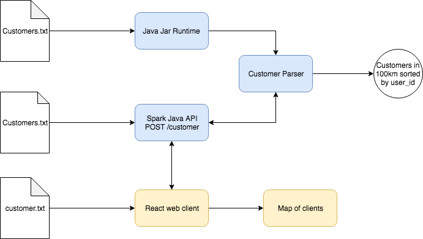

# Intercom

## System design

After reading the techtest my first I've developed the simple batch flow using jar file to read a file and parse to an ouput.

Then I've created a small example of a web consuming an API endpoint using the same code to return the customers in range of 100km.

### Libraries Used
* [Spark](http://sparkjava.com): micro framework for creating endpoints that can run in an embedded server (jetty);
* [Gson](https://github.com/google/gson): framework to serialize/deserialize objects from/to JSON;
* [ReactJS](https://reactjs.org/): Javascript library for ui.

## How to run

First we need to pack the project:

    //Unix
    cd server/ && ./mvnw clean package
    
    //Windows
    cd api && mvnw clean package

### 1 - Bash mode

In order to run the algorithm in a batch mode, execute the following in a terminal:

    java -jar server/target/intercom-customer-finder.jar customers_example.txt

Passing a string with path file as argument you will receive the ouput of customers in 100km.

### 2 - Server mode

    java -jar server/target/intercom-customer-finder.jar

Then a server will be running in `http://localhost:4567/` and the endpoint `/customer` created:
* [POST] /customer: Add a file as parameter to consume this endpoint and receive the list of customers in 100km

### 3 - Client

Execute the command:

    cd client/ && npm install && npm start

The client will be running in `http://localhost:3000/`

